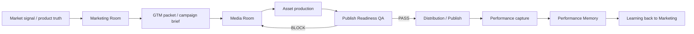

# 056_MARKETING_MEDIA_FLOW_v1

**Classification:** `[SYSTEM ROOT]`  
**Status:** Cross-department flow spec for Marketing Room and Media Room  
**Purpose:** Define the governed lifecycle from brief to publish to memory

---

# 0. Flow Principle

Marketing defines the truth boundary.
Media turns the approved truth into assets.
QA decides if the asset is release-safe.
Distribution publishes only approved assets.
Memory learns from outcomes.

No stage may skip the one before it.

---

# 1. Flow Overview

---

# 2. Stage-by-Stage Flow

## Stage 1 - Intake

Input:

- market signal
- product truth
- offer truth
- campaign objective

Owner:

- Marketing Room

Output:

- verified brief
- claim boundary
- proof boundary
- audience direction
- required handoff metadata

Hard Rule:

- if truth is incomplete, block

---

## Stage 2 - Marketing Translation

Marketing Room converts truth into governed marketing artifacts:

- GTM packet
- campaign brief
- content brief
- distribution brief
- positioning note

Owner:

- Chief Marketing Agent

Hard Rule:

- no pricing, billing, or auth truth may be rewritten here

---

## Stage 3 - Media Handoff

Media Room receives:

- campaign brief
- approved claim boundary
- proof references
- platform constraints
- asset requirements

Media Room produces:

- image prompts
- motion prompts
- video keyframes
- caption drafts
- packaging variants
- render-ready assets

Hard Rule:

- Media may not change offer truth
- Media may not widen claims

---

## Stage 4 - QA Gate

QA validates:

- claim accuracy
- proof alignment
- public-safe boundary
- format correctness
- anti-hype compliance
- launch readiness

Possible outcomes:

- PASS
- BLOCK
- RETURN_TO_MEDIA
- RETURN_TO_MARKETING

Hard Rule:

- no publish without QA pass

---

## Stage 5 - Distribution / Publish

Distribution consumes:

- QA-passed asset
- approved publish metadata
- timing rules
- platform strategy

Output:

- live post
- publish URL
- channel record
- timestamp

Hard Rule:

- no distribution action may invent state

---

## Stage 6 - Performance Capture

After publish, capture:

- reach
- CTR
- saves
- shares
- comments
- watch retention
- leads or soft conversion signals

Owner:

- Performance Memory

Hard Rule:

- capture outcomes only, do not rewrite history

---

## Stage 7 - Learning Loop

Performance Memory returns insights to Marketing:

- best hooks
- best visuals
- best CTA patterns
- best platforms
- weak patterns
- rollback signals

Marketing uses this learning to improve the next brief.

Hard Rule:

- memory informs future decisions
- memory does not override current truth

---

# 3. Handoff Contract Between Marketing and Media

Every handoff must include:

- owner
- department
- current state
- requested next state
- source of truth
- proof references
- approval requirement
- blocked actions
- next owner
- next required action

If any field is missing, the handoff is invalid.

---

# 4. Escalation Triggers

Escalate back to Marketing when:

- claims are too weak or too strong
- proof is missing
- platform format conflicts with truth
- the asset cannot be made public-safe

Escalate to Human when:

- launch risk is high
- claims touch sensitive areas
- approval is required
- any core truth is unclear

---

# 5. Operating Rule Summary

| Stage | Owner | Output | Blocker |
|---|---|---|---|
| Intake | Marketing | verified brief | missing truth |
| Translation | Marketing | GTM packet | claim drift |
| Production | Media | assets | boundary widening |
| QA | QA | pass/block | weak proof |
| Publish | Distribution | live record | no QA pass |
| Memory | Performance Memory | insight set | no publish data |

