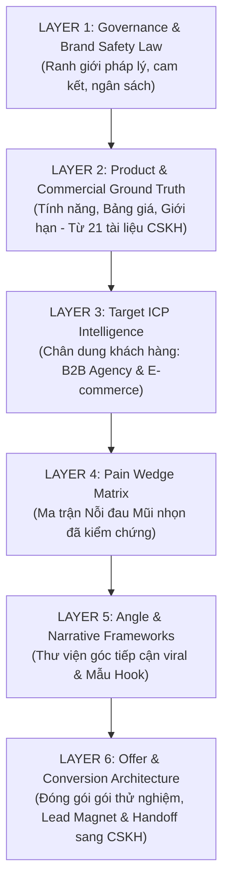

# PN MEDIA PLUS — MARKETING KNOWLEDGE BLUEPRINT v1.0
## Governed Modular Knowledge Architecture for Agent 01 (Viral Research & Angle)
**Phiên bản:** v1.0  
**Tác giả:** Marketing Knowledge Architect & Bot CTO  
**Phạm vi áp dụng:** Agent 1 (Viral Research & Angle) và luồng Upstream Marketing của PN Media Plus  
**Mục tiêu cốt lõi:**  
> Cung cấp đầy đủ cơ sở dữ liệu (Ground Truth) để **Agent 01** thực thi chuỗi quyết định:  
> **ICP ➔ Pain Wedge ➔ Offer ➔ Creative Architecture**  
> mà **giảm thiểu tối đa việc tự suy luận và loại bỏ 100% việc tự bịa dữ kiện (Zero Hallucination)**.

---

## 🏛️ PHẦN I: NGUYÊN TẮC THIẾT KẾ TRI THỨC NGƯỢC (REVERSE KNOWLEDGE DESIGN)

Thay vì viết tài liệu theo cảm tính, bộ Blueprint này được thiết kế **đi ngược từ 24 trường dữ liệu đầu ra bắt buộc của Agent 01**:

```text
               OUTPUT CỦA AGENT 01 (24 TRƯỜNG JSON)
                                 │
                                 ▼
                    CẦN RA QUYẾT ĐỊNH GÌ?
   (Chọn ICP? Chọn Pain nào? Đề xuất Offer nào? Rủi ro là gì?)
                                 │
                                 ▼
                     CẦN DỮ KIỆN GÌ ĐỂ CHỌN?
                                 │
                                 ▼
        6 LAYER TRI THỨC ĐƯỢC CHUẨN HÓA (KNOWLEDGE BLUEPRINT)
```

---

## 📚 PHẦN II: CẤU TRÚC 6 LAYER TRI THỨC TIẾP THỊ (THE 6-LAYER ARCHITECTURE)



---

### 🛡️ LAYER 1: GOVERNANCE, BRAND SAFETY & INFERENCE BOUNDARIES
*(Tri thức dùng chung — Trạng thái: Tái sử dụng & Khóa cứng)*

#### 1. Ranh giới suy luận bất biến của Agent 01:
* **ĐƯỢC PHÉP**: 
  - Xếp hạng (Rank) mức độ ưu tiên của các Pain Points có sẵn trong Layer 4 cho một brief cụ thể.
  - Chọn 1 trong các Angles có sẵn tại Layer 5 phù hợp với mục tiêu và thời lượng chiến dịch.
  - Phân bổ ngân sách theo từng ngày trong `daily_timeline` dựa trên tổng ngân sách người dùng cấp.
* **CẤM TUYỆT ĐỐI (FAIL-CLOSED)**:
  - ❌ CẤM tự bịa ra tính năng hoặc dịch vụ không có trong Layer 2.
  - ❌ CẤM tự tạo bảng giá, chiết khấu hoặc điều kiện bảo hành không có trong Layer 2.
  - ❌ CẤM tự bịa số liệu dung lượng thị trường (Market Size) nếu không có nguồn web search (Tavily).
  - ❌ CẤM sử dụng các tuyên bố tuyệt đối: *"100% ra đơn"*, *"Cam kết x5 doanh thu"*, *"Không cần làm gì cũng có khách"*.
* **Cảnh báo bất khả thi (Budget Deficit Gate)**:
  - Nếu `Ngân sách tổng / Số ngày < 100.000 VNĐ/ngày` hoặc `Ngân sách < Benchmark CPL ngành`:
  - Agent 01 **BẮT BUỘC** gán `needs_clarification = true`, dừng tạo timeline giả định và liệt kê bài toán tính toán vào `clarification_questions`.

---

### 📦 LAYER 2: PRODUCT & COMMERCIAL GROUND TRUTH
*(Tri thức dùng chung — Trạng thái: Tái sử dụng 100% từ 21 tài liệu CSKH hiện hữu)*

Agent 01 sử dụng trực tiếp các tài liệu canonical sau làm căn cứ sự thật cho sản phẩm:

| Danh mục | Tài liệu nguồn (Source Document) | Dữ liệu Agent 01 được phép trích xuất |
| :--- | :--- | :--- |
| **Catalog Sản phẩm** | `01_PN_MASTER_COMMERCIAL_PRODUCT_MATRIX_v1.0.md` | Tên chính xác 4 dòng dịch vụ: CRM Điều phối, n8n Automation, AI Chatbot CSKH, Media Production. |
| **Bảng giá chuẩn** | `PN_AGENCY_CRM_PRICE_MATRIX_v1.0.md` | Giá gói Starter, Growth, Enterprise. Chi phí setup, phí duy trì hàng tháng. Tuyệt đối không tự sửa giá. |
| **Tính năng chi tiết** | `02_FEATURE_CATALOG.md` | Các tính năng thực tế đang chạy: Quản lý task, Tự động phân công, Chatbot đa kênh, Trích xuất lead. |
| **Giới hạn kỹ thuật** | `05_KNOWN_LIMITATIONS.md` & `08_PRODUCT_SCOPE...` | Những gì hệ thống **KHÔNG LÀM ĐƯỢC** (Out-of-scope) để điền vào trường `do_not_do` và `risks_policy`. |

---

### 👥 LAYER 3: TARGET ICP INTELLIGENCE (CHÂN DUNG KHÁCH HÀNG MỤC TIÊU)
*(Tri thức đặc thù — Trạng thái: Xây mới chuẩn hóa)*

#### 🎯 ICP-01: Chủ Doanh Nghiệp Marketing / Creative Agencies (Trọng tâm P0)
* **Quy mô**: 5 – 30 nhân sự.
* **Đặc điểm nhận diện**:
  - Nhận nhiều dự án cùng lúc, vận hành qua Zalo/Telegram/Google Sheets lộn xộn.
  - Đội ngũ Designer, Content, Media, Account bàn giao việc rời rạc, hay quên deadline.
  - Người sáng lập (Founder/Owner) bị sa lầy vào việc kiểm tra tiến độ vụn vặt thay vì đi bán hàng.
* **Mục tiêu ưu tiên**: Tự động hóa khâu bàn giao, nhìn thấy bức tranh dự án trong 1 màn hình, giảm thời gian họp hành.

#### 🎯 ICP-02: Chủ Shop Bán Lẻ / E-commerce & Thời Trang (Mở rộng P1)
* **Quy mô**: 3 – 15 nhân sự (Chủ shop + 2-5 nhân viên trực chat/vận đơn).
* **Đặc điểm nhận diện**:
  - Chạy quảng cáo Facebook/TikTok chi phí ngày càng cao nhưng tỷ lệ chốt đơn thấp.
  - Khách hàng inbox buổi tối/cuối tuần thường bị trả lời chậm (sau 15-30 phút), dẫn đến mất đơn.
  - Nhân viên trực page nghỉ việc liên tục, mỗi lần tuyển mới phải đào tạo lại từ đầu kịch bản báo giá.
* **Mục tiêu ưu tiên**: Trả lời khách trong 5 giây 24/7, tự động lấy SĐT khách và đẩy về đơn hàng, không bị sót khách.

---

### 💥 LAYER 4: PAIN WEDGE MATRIX (MA TRẬN NỖI ĐAU MŨI NHỌN ĐÃ KIỂM CHỨNG)
*(Tri thức đặc thù — Trạng thái: Xây mới chuẩn hóa)*

Agent 01 **chỉ được phép chọn Pain Wedge từ ma trận này**, không tự bịa nỗi đau mới:

| Mã Pain | Tên Nỗi Đau Mũi Nhọn | Nhóm ICP | Bằng chứng thực tế (Evidence) | Hậu quả trực tiếp |
| :--- | :--- | :---: | :--- | :--- |
| **PAIN-01** | **"Sót Lead / Cháy Inbox Khách Hàng Buổi Tối"** | ICP-02 (Shop) | Khách hỏi lúc 22h-24h, 8h sáng hôm sau nhân viên mới nhắn lại thì khách đã mua bên khác. | Lãng phí 30-40% tiền chạy quảng cáo; CPL tăng gấp đôi. |
| **PAIN-02** | **"Tam Sao Thất Bản Khi Bàn Giao Dự Án"** | ICP-01 (Agency) | Brief khách đưa cho Account một đằng, sang Content một nẻo, sang Designer thành một kiểu khác. | Khách hàng đòi sửa bài 5-7 lần, trễ hạn bàn giao, nhân sự ức chế. |
| **PAIN-03** | **"Nợ Báo Cáo & Không Rõ Ai Đang Làm Gì"** | ICP-01 (Agency) | Cuối tuần họp mới phát hiện bài đăng chưa lên, file thiết kế thất lạc trên Google Drive. | Chủ agency mất uy tín với khách hàng, phải thức đêm làm bù. |
| **PAIN-04** | **"Chi Phí Quảng Cáo Đắt Nhưng Tỷ Lệ Chốt Giảm"** | ICP-02 (Shop) | Tin nhắn về nhiều nhưng toàn hỏi giá rồi im lặng; nhân viên không biết cách bám đuổi (follow-up). | Biên lợi nhuận mỏng dính, shop bán được doanh số nhưng không có lãi. |

---

### 🎯 LAYER 5: ANGLE & NARRATIVE FRAMEWORKS (THƯ VIỆN GÓC TIẾP CẬN VIRAL)
*(Tri thức đặc thù — Trạng thái: Xây mới chuẩn hóa)*

Agent 01 chọn 1 trong 4 Khung Tiếp Cận (Narrative Angles) đã được kiểm chứng:

#### 1. Angle A: "Vạch Trần Sự Lãng Phí Tiền Quảng Cáo" (Waste Exposure)
* **Ý tưởng cốt lõi**: Không tập trung khen AI thần thánh, mà chỉ ra chủ shop đang đốt tiền quảng cáo vô ích vì không có người trực chat ban đêm.
* **Mẫu Hook cho Agent 02**: *"Bạn chi 500k tiền ads mỗi ngày, nhưng 200k trong số đó bị vứt vào sọt rác chỉ vì 1 tin nhắn trả lời chậm 15 phút."*
* **Khung chuyển dịch**: Trả lời chậm ➔ Mất đơn ➔ Giải pháp: AI CSKH phản hồi trong 3 giây.

#### 2. Angle B: "Hồi Chuông Cảnh Tỉnh Về Quản Trị Hỗn Loạn" (Chaos vs Control)
* **Ý tưởng cốt lõi**: Đánh vào nỗi sợ của chủ Agency khi nhóm chat Zalo có hàng chục nhóm và không kiểm soát nổi tiến độ.
* **Mẫu Hook cho Agent 02**: *"Có bao nhiêu lần bạn phải thốt lên: 'Ủa bài này sao chưa đăng?' vào lúc 9 giờ tối?"*
* **Khung chuyển dịch**: Quản lý bằng chat vụn vặt ➔ Bỏ sót việc ➔ Giải pháp: Pipeline CRM nhìn 1 màn hình rõ từng người phụ trách.

#### 3. Angle C: "Thử Nghiệm Nhỏ - Rủi Ro Bằng Không" (Micro-Pilot / Risk Reversal)
* **Ý tưởng cốt lõi**: Khách hàng sợ ký hợp đồng dài hạn, giải pháp là gói thử nghiệm 10 ngày / 15 ngày với chi phí chỉ bằng 1 bữa lẩu.
* **Mẫu Hook cho Agent 02**: *"Đừng vội mua phần mềm cả năm. Hãy thử chạy thử nghiệm 10 ngày để xem AI có thực sự cứu được chi phí nhân sự của bạn không."*

#### 4. Angle D: "Nghiên Cứu Điển Hình Trước & Sau" (Before & After Case Study)
* **Ý tưởng cốt lõi**: Kể câu chuyện một shop thời trang/agency thực tế đã giảm 70% thời gian họp và tăng 25% tỷ lệ chốt đơn sau khi có bot.

---

### 💰 LAYER 6: OFFER PACKAGING & CONVERSION BRIDGE (ĐÓNG GÓI ƯU ĐÃI & BÀN GIAO CSKH)
*(Tri thức đặc thù — Trạng thái: Xây mới chuẩn hóa)*

#### 1. Cấu trúc Gói Thử Nghiệm Chuẩn (The 10-Day Pilot Offer Framework):
* **Tên gói**: `Gói Trải Nghiệm Tự Động Hóa Vận Hành 10 Ngày`.
* **Mức phí**: Cố định `2.000.000 VNĐ` (hoặc tính theo ngân sách brief).
* **Quyền lợi khách nhận được**:
  1. 01 Kịch bản AI CSKH chuẩn hóa theo đúng catalog sản phẩm của khách.
  2. Kết nối trực tiếp vào Fanpage Facebook thử nghiệm trong 10 ngày.
  3. Báo cáo đo lường chi tiết: Số lead thu thập được, tốc độ phản hồi trung bình, tỷ lệ giữ chân khách.
* **Cam kết an toàn (Risk Reversal)**: Hoàn phí dịch vụ nếu hệ thống không hoạt động đúng cam kết kỹ thuật trong 7 ngày đầu.

#### 2. Cầu Nối Bàn Giao Tri Thức Sang CSKH (Conversion Bridge):
* Khi chiến dịch Marketing được kích hoạt, các dữ kiện tại Layer này sẽ được đóng gói thành **Handoff Packet** đẩy sang cho Bot CSKH:
  - Tên chương trình: `Gói Trải Nghiệm 10 Ngày`.
  - Giá: `2.000.000 VNĐ`.
  - Điều kiện: Áp dụng cho 20 khách hàng đăng ký sớm nhất trong tháng.
  - FAQ: Khách hỏi *"Cài đặt có lâu không?"* ➔ Bot CSKH trả lời: *"Dạ chỉ mất 24h để kỹ thuật setup kịch bản riêng cho bên mình ạ."*

---

## 📋 PHẦN III: BẢNG ÁNH XẠ TRI THỨC VÀO 24 TRƯỜNG OUTPUT CỦA AGENT 01

Để loại bỏ hoàn toàn việc Agent 01 tự suy luận hoặc bịa dữ liệu, mọi trường trong JSON Output của Agent 01 phải được lấy từ các Layer tương ứng:

| Trường Output của Agent 01 | Nguồn Tri Thức Cung Cấp (Source Layer) | Quy tắc điền dữ liệu |
| :--- | :--- | :--- |
| `executive_decision` | **Layer 5 + Brief** | Khớp góc tiếp cận (Angle) với mục tiêu của brief. |
| `icp_and_pain_wedge` | **Layer 3 & Layer 4** | Chọn chính xác 1 ICP từ Layer 3 và 1 Pain từ Layer 4. |
| `offer` | **Layer 6** | Sử dụng The 10-Day Pilot Offer Framework. |
| `funnel_architecture` | **Layer 6** | Điền cấu trúc phễu 3 tầng: Attention ➔ Conversation ➔ Pilot Demo. |
| `crm_role` & `chatbot_role` | **Layer 2** | Lấy tính năng thực tế từ `02_FEATURE_CATALOG.md`. |
| `creative_architecture` | **Layer 5** | Sử dụng mẫu Concept tương ứng của Angle được chọn. |
| `media_buying_structure` | **Brief & Layer 1** | Chia tỷ lệ ngân sách (Ví dụ: 70% Thử nghiệm Angle chính, 30% Angle phụ). |
| `10_day_operating_plan` & `daily_timeline` | **Brief & Layer 5** | Tạo đủ số ngày theo brief, mỗi ngày gắn 1 Creative Hook từ Layer 5. |
| `risks_policy` & `do_not_do` | **Layer 1 & Layer 2** | Trích xuất từ `05_KNOWN_LIMITATIONS.md` và luật Brand Safety. |
| `lead_qualification` | **Layer 3** | Tiêu chuẩn: Đúng ngành (Agency/Shop), có ngân sách, có vấn đề sót đơn. |
| `sales_handoff` | **Layer 6** | Kịch bản chuyển lead từ Chatbot sang Telesales chốt demo. |

---

## 🏁 KẾT LUẬN & ĐỀ XUẤT NGHIỆM THU

1. Bản Blueprint này đã **giải quyết triệt để bài toán của Bot CTO**:
   - Xác định rõ: Cần gì cho Agent 01? ➔ Cần 6 Layer tri thức đã được đóng gói chặt chẽ.
   - Định rõ: Cái gì tái sử dụng? ➔ Toàn bộ Layer 1 & Layer 2 (từ 21 tài liệu CSKH).
   - Định rõ: Cái gì mới? ➔ Layer 3 (ICP), Layer 4 (Pain Wedge), Layer 5 (Angles), Layer 6 (Offer Framework).
2. Khi tài liệu này được thông qua, Agent 01 sẽ vận hành theo mô hình **Zero-Hallucination**:
   - Không thể tự bịa tính năng.
   - Không thể tự bịa bảng giá.
   - Không thể tự bịa nỗi đau.
   - Toàn bộ kết quả sinh ra đều nhất quán và sẵn sàng handoff sang Bot CSKH!

---
*(Tài liệu lưu trữ tại: `docs/marketing/PN_MEDIA_PLUS_MARKETING_KNOWLEDGE_BLUEPRINT_v1.0.md`)*
