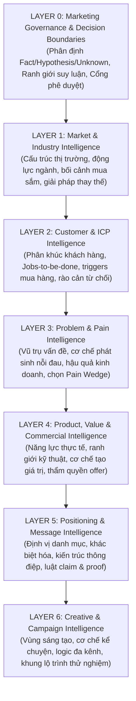

# PN MEDIA PLUS — MARKETING KNOWLEDGE BLUEPRINT v1.0
## System-Governed Multi-Industry Knowledge Architecture for Autonomous Marketing Agents

**Phiên bản:** v1.0 (Canonical Blueprint)  
**Cơ quan phê duyệt:** Bot CTO & Marketing Knowledge Architect  
**Phạm vi áp dụng:** Toàn bộ hệ thống Marketing Agents (Agent 01 đến Agent 07) của PN Media Plus  
**Mục tiêu tối thượng:**  
> Thiết lập một **Hệ Thống Tri Thức Tiếp Thị Đa Ngành Chuẩn Mực**, ngăn chặn triệt để tình trạng ảo giác dữ liệu (Zero Hallucination), cung cấp đầy đủ cơ sở chứng cứ để **Agent 01 (Viral Research & Angle)** thực thi chuỗi suy luận logic:  
> **MARKET ➔ CUSTOMER ➔ PAIN WEDGE ➔ VALUE MATCH ➔ POSITIONING ➔ MESSAGE ➔ OFFER ➔ CREATIVE ➔ CAMPAIGN**  
> mà không tự bịa đặt dữ kiện, không nâng giả thuyết thành sự thật và không đưa ra các cam kết thương mại trái phép.

---

## 🧭 PHẦN I: NGUYÊN TẮC QUẢN TRỊ TRI THỨC (EPISTEMIC GOVERNANCE LAWS)

### 1. Luật Phân Tách Trạng Thái Nhận Thức (Epistemic Status Discipline)
Mọi đơn vị tri thức (Knowledge Unit) nạp vào hệ thống hoặc do Agent sinh ra bắt buộc phải mang đúng một trong 5 nhãn nhận thức:

```yaml
epistemic_status:
  VERIFIED:
    definition: "Dữ kiện đã được chứng minh qua dữ liệu thực tế (Hợp đồng, CRM, tài chính, audit)."
    authority: "Agent được phép trích dẫn như một sự thật khách quan (Fact)."

  SUPPORTED:
    definition: "Dữ kiện có nguồn nghiên cứu bên ngoài đáng tin cậy (Báo cáo thị trường, Tavily web search có citation)."
    authority: "Agent được phép dùng làm cơ sở tham khảo, phải trích dẫn nguồn."

  HYPOTHESIZED:
    definition: "Giả thuyết định vị, góc tiếp cận thử nghiệm, ý tưởng sáng tạo chưa qua kiểm chứng thị trường."
    authority: "Agent BẮT BUỘC phải dán nhãn là 'Giả định/Thử nghiệm', CẤM tuyên bố như Fact."

  INFERRED:
    definition: "Kết luận logic được suy ra từ các Fact đã có (Ví dụ: Tổng ngân sách 2M / 10 ngày = 200k/ngày)."
    authority: "Agent được phép suy luận nếu chuỗi logic toán học/nghiệp vụ hợp lệ."

  UNKNOWN:
    definition: "Thông tin chưa có trong Knowledge Base và chưa tìm thấy nguồn chứng minh."
    authority: "Agent BẮT BUỘC phải dừng lại, hỏi người dùng hoặc gán needs_clarification=true. CẤM TỰ BỊA."
```

### 2. Chuỗi Suy Luận Bắt Buộc (The Canonical Marketing Reasoning Chain)
Agent 01 không được phép nhảy cóc từ một ý tưởng ngẫu hứng sang viết Hook quảng cáo. Mọi chiến dịch phải đi qua đúng 10 mắt xích logic:

```text
1. MARKET & INDUSTRY CONTEXT
         ↓
2. CUSTOMER SEGMENTATION
         ↓
3. ICP SELECTION (Chân dung khách hàng mục tiêu)
         ↓
4. PROBLEM UNIVERSE & PAIN WEDGE (Nỗi đau mũi nhọn)
         ↓
5. PRODUCT-VALUE CAPABILITY MATCH (Khớp nối giá trị giải pháp)
         ↓
6. POSITIONING (Định vị thương hiệu trong tâm trí)
         ↓
7. MESSAGE ARCHITECTURE (Cấu trúc thông điệp cốt lõi)
         ↓
8. COMMERCIAL OFFER (Gói giải pháp & Điều kiện thương mại)
         ↓
9. CREATIVE TERRITORY & ANGLES (Vùng sáng tạo & Góc tiếp cận)
         ↓
10. CAMPAIGN STRATEGY & EXPERIMENTAL TIMELINE (Lộ trình thử nghiệm)
```

---

## 🏛️ PHẦN II: KIẾN TRÚC 7 LAYER TRI THỨC CHUẨN HÓA (THE 7-LAYER SYSTEM)



---

### 🛡️ LAYER 0: MARKETING GOVERNANCE & DECISION BOUNDARIES
**Mục tiêu:** Thiết lập rào chắn kiểm soát hành vi nhận thức và thẩm quyền quyết định của Agent Marketing.

1. **Ranh giới suy luận (Inference Boundaries)**:
   - Agent 01 được phép: Lựa chọn phân khúc ICP mục tiêu từ danh mục Layer 2; chọn Pain Wedge từ Layer 3; khớp tính năng từ Layer 4; chọn Vùng sáng tạo từ Layer 6; chia nhỏ ngân sách theo ngày.
   - Agent 01 **CẤM TUYỆT ĐỐI**:
     - Tự bịa tính năng sản phẩm chưa có trong Catalog Layer 4.
     - Tự ý giảm giá, tạo combo khuyến mại, hoặc hứa hẹn điều kiện bảo hành ngoài bảng giá chính thức.
     - Tự tạo ra case study giả hoặc thống kê số liệu thị trường không có nguồn dẫn.
     - Sử dụng các tuyên bố cam kết tuyệt đối (*"100% thành công"*, *"Rủi ro bằng 0"*, *"Cam kết x5 doanh thu"*).
2. **Cổng kiểm soát an toàn (Governance Gates)**:
   - *Budget Deficit Gate*: Nếu `Ngân sách / Số ngày < Ngưỡng tối thiểu của nền tảng` hoặc không đủ bù đắp chi phí CPM/CPL cơ bản ➔ Dừng lại, gán `needs_clarification = true`.
   - *Human Final Authority*: Mọi đề xuất chiến dịch của Agent 01 chỉ mang tính chất khuyến nghị (`RECOMMENDATION`), bắt buộc phải có sự phê duyệt của con người (`Human Approval`) trước khi downstream agent tiến hành sản xuất hàng loạt.

---

### 🌐 LAYER 1: MARKET & INDUSTRY INTELLIGENCE
**Mục tiêu:** Cung cấp bối cảnh vĩ mô và động lực của ngành để định vị sản phẩm phù hợp thực tế cạnh tranh.

1. **Bối cảnh thị trường (Market Landscape & Dynamics)**:
   - Thị trường đang ở giai đoạn nào: Giáo dục thị trường (Market Education), Cạnh tranh gay gắt (High Competition), hay Tối ưu chi phí (Cost Cutting)?
   - Xu hướng công nghệ & tự động hóa tác động đến hành vi của người ra quyết định.
2. **Các giải pháp thay thế hiện có (Competitive Alternatives)**:
   Trước khi mua giải pháp của PN Media Plus, khách hàng đang giải quyết vấn đề bằng cách nào?
   - *Cách 1*: Tự làm thủ công (Dùng Google Sheets, nhóm chat Zalo/Telegram).
   - *Cách 2*: Thuê thêm nhân sự (Tuyển thêm content, nhân viên trực chat, trợ lý).
   - *Cách 3*: Dùng các phần mềm SaaS rời rạc nước ngoài nhưng không tích hợp được với nhau và chi phí cao.
   - 👉 *Agent 01 phải hiểu rõ các giải pháp thay thế này để so sánh và nêu bật giá trị cốt lõi.*

---

### 👥 LAYER 2: CUSTOMER & ICP INTELLIGENCE
**Mục tiêu:** Hiểu sâu sắc đối tượng mục tiêu, vai trò của người mua, động lực và rào cản tâm lý.

1. **Mô hình Khách hàng Mục tiêu (ICP Schema)**:
   Mỗi chân dung khách hàng trong Knowledge Base bắt buộc phải xác định:
   - *Firmographics*: Quy mô doanh thu, số lượng nhân sự, ngành nghề, cấu trúc tổ chức.
   - *Buyer Persona*: Ai là người nắm ngân sách (Economic Buyer)? Ai là người dùng trực tiếp (User Persona)?
   - *Jobs-To-Be-Done (JTBD)*: Khi tìm kiếm giải pháp, họ muốn hoàn thành công việc gì? (Ví dụ: "Tôi muốn yên tâm đi ngủ buổi tối mà không sợ nhân viên bỏ sót khách hàng").
2. **Sự kiện kích hoạt nhu cầu (Buying Triggers)**:
   Điều gì xảy ra khiến họ phải tìm kiếm giải pháp ngay hôm nay? (Ví dụ: Mùa cao điểm bán hàng, vừa bị mất một hợp đồng lớn do chậm tiến độ, nhân viên chủ chốt nghỉ việc đột ngột).
3. **Danh mục các lý do từ chối thường gặp (Objections Taxonomy)**:
   *(Trích xuất từ 21 tài liệu CSKH và thực tế tư vấn)*:
   - "Phần mềm có khó dùng cho nhân viên lớn tuổi không?"
   - "Dữ liệu khách hàng của tôi lưu ở đâu, có bị lộ cho đối thủ không?"
   - "Chi phí duy trì hàng tháng có phát sinh thêm gì không?"
   - "Nếu không hiệu quả thì có được hoàn tiền không?"

---

### 💥 LAYER 3: PROBLEM & PAIN INTELLIGENCE
**Mục tiêu:** Bản đồ hóa các vấn đề nhức nhối để Agent 01 chọn đúng "Nỗi Đau Mũi Nhọn" (Pain Wedge) cho chiến dịch.

1. **Phân loại vấn đề & Nỗi đau (Pain Taxonomy)**:
   - *Nỗi đau tài chính (Financial Pain)*: Lãng phí chi phí quảng cáo, chi phí nhân sự tăng cao nhưng năng suất không đổi.
   - *Nỗi đau vận hành (Operational Pain)*: Quy trình bàn giao lộn xộn, mất dữ liệu, trễ deadline, tam sao thất bản giữa các khâu.
   - *Nỗi đau tâm lý của người quản lý (Emotional/Leadership Pain)*: Lo lắng, kiệt sức, mất quyền kiểm soát, luôn trong trạng thái đi dập lửa sự cố.
2. **Tiêu chuẩn lựa chọn Nỗi Đau Mũi Nhọn (Pain Wedge Criteria)**:
   Agent 01 chỉ được chọn một Pain Wedge khi thỏa mãn 3 điều kiện:
   - `Độ nhức nhối (Severity)`: Khách hàng cảm nhận được hậu quả tiêu cực hàng ngày.
   - `Tính nhận thức (Awareness)`: Khách hàng thừa nhận đó là vấn đề của họ, không cần giải thích dài dòng.
   - `Khả năng giải quyết của giải pháp (Solvability)`: Sản phẩm của PN Media Plus có năng lực xử lý dứt điểm trong vòng 7–14 ngày đầu tiên.

---

### 📦 LAYER 4: PRODUCT, VALUE & COMMERCIAL INTELLIGENCE
**Mục tiêu:** Nguồn sự thật về năng lực sản phẩm, giá cả và ranh giới dịch vụ.

1. **Nguồn sự thật sản phẩm (Product Ground Truth)**:
   *(Khai thác từ Catalog sản phẩm và tài liệu CSKH)*:
   - *Tính năng lõi*: CRM điều phối công việc, Tự động hóa n8n workflow, AI Chatbot CSKH đa kênh, Media Production.
   - *Ranh giới kỹ thuật & Out-of-scope*: Những gì hệ thống không hỗ trợ (Ví dụ: Không can thiệp sâu vào code website đóng của bên thứ ba, không cung cấp cam kết tăng trưởng follower ảo).
2. **Cơ chế tạo giá trị (Value Mechanisms)**:
   - Sản phẩm giải quyết nỗi đau bằng cơ chế nào? (Ví dụ: Bằng cách phản hồi khách hàng trong 3 giây ➔ Giữ chân khách hàng ngay khi nhu cầu đang nóng nhất).
3. **Thẩm quyền chào hàng thương mại (Commercial Offer Governance)**:
   - Agent 01 chỉ được đề xuất các gói dịch vụ và mức giá nằm trong Bảng giá chính thức đã được phê duyệt.
   - Mọi cấu trúc gói thử nghiệm (Pilot Offer) phải nêu rõ: Phạm vi công việc, thời gian triển khai, giá cố định và điều kiện áp dụng cụ thể.

---

### 🎯 LAYER 5: POSITIONING & MESSAGE INTELLIGENCE
**Mục tiêu:** Định hình vị thế thương hiệu trong tâm trí khách hàng và cấu trúc thông điệp thuyết phục.

1. **Khung định vị (Positioning Framework)**:
   - *Category*: PN Media Plus định nghĩa mình là gì? (Hệ điều hành Doanh nghiệp Vận hành bằng AI & Tự động hóa).
   - *Differentiation*: Điểm khác biệt cốt lõi so với thị trường (Không bán công cụ rời rạc mà cung cấp giải pháp trọn gói kèm kịch bản vận hành thực chiến).
2. **Kiến trúc thông điệp (Message Architecture)**:
   - *Core Value Proposition (Lời hứa giá trị trung tâm)*.
   - *Pillars (Các trụ cột hỗ trợ)*: Tinh gọn, Tức thì, Minh bạch, Đo lường được.
3. **Luật quản trị Claim & Bằng chứng (Claim & Proof Governance)**:
   - Mọi lời tuyên bố (Claim) bắt buộc phải có bằng chứng chứng minh (Proof Architecture): Demo trực quan, logic toán học minh bạch, hoặc tài liệu hướng dẫn kỹ thuật.
   - Tuyệt đối cấm các tuyên bố phóng đại hoặc cam kết không có căn cứ.

---

### 🎨 LAYER 6: CREATIVE & CAMPAIGN INTELLIGENCE
**Mục tiêu:** Chuyển hóa chiến lược và thông điệp thành các concept sáng tạo và lộ trình thử nghiệm chiến dịch.

1. **Vùng sáng tạo (Creative Territories)**:
   Các chủ đề lớn mà nội dung tiếp thị có thể khai thác:
   - *Territory 1: Sự đối lập giữa Hỗn loạn và Trật tự (Chaos vs Order)*.
   - *Territory 2: Vạch trần chi phí ẩn của sự chậm trễ (The Cost of Inaction)*.
   - *Territory 3: Giải phóng sức lao động của người sáng lập (Founder Freedom)*.
2. **Góc tiếp cận (Angles) & Khung kể chuyện (Narrative Mechanisms)**:
   - Biến đổi Territory thành các Angle cụ thể phù hợp từng định dạng truyền thông (Video ngắn, Bài viết dài, Infographic).
3. **Khung thực nghiệm chiến dịch (Campaign Experimentation Framework)**:
   - Lộ trình thử nghiệm (Timeline: 7 ngày, 10 ngày, 15 ngày).
   - Thiết lập cổng kiểm soát chất lượng theo chu kỳ:
     - *Day 3 Gate*: Kiểm tra tín hiệu tương tác ban đầu (CTR, Hook retention). Nếu không có tín hiệu ➔ Điều chỉnh Angle.
     - *Day 6 Gate*: Kiểm tra tỷ lệ chuyển đổi thành hội thoại/lead (Conversation rate).
     - *End-of-Pilot Decision*: Khung tiêu chí quyết định nhân rộng (Scale), tối ưu (Iterate), hay dừng thử nghiệm (Kill).

---

## 🌐 PHẦN III: PHÂN TÁCH TRI THỨC DÙNG CHUNG VS ĐẶC THÙ NGÀNH (MULTI-INDUSTRY SCALABILITY)

Để hệ thống có thể mở rộng phục vụ nhiều ngành nghề mà không phải viết lại từ đầu, Blueprint phân tách rạch ròi 2 cấu phần:

```text
┌────────────────────────────────────────────────────────────────────────┐
│             UNIVERSAL MARKETING ENGINE (DÙNG CHUNG 100%)               │
├────────────────────────────────────────────────────────────────────────┤
│ • Layer 0: Governance, Ranh giới suy luận, Nhãn nhận thức Epistemic   │
│ • Layer 4: Năng lực sản phẩm lõi & Ranh giới kỹ thuật PN Media Plus    │
│ • Layer 5: Khung định vị tổng thể, Luật quản trị Claim & Proof         │
│ • Layer 6: Phương pháp luận thực nghiệm chiến dịch, Cổng Day 3/Day 6   │
└───────────────────────────────────┬────────────────────────────────────┘
                                    │ CẮM GHÉP (PLUG-AND-PLAY)
       ┌────────────────────────────┼────────────────────────────┐
       ▼                            ▼                            ▼
┌──────────────┐             ┌──────────────┐             ┌──────────────┐
│ INDUSTRY     │             │ INDUSTRY     │             │ INDUSTRY     │
│ PACK 01:     │             │ PACK 02:     │             │ PACK 03:     │
│ B2B Services │             │ B2C Retail   │             │ Healthcare & │
│ & Agencies   │             │ & E-commerce │             │ Clinic / Spa │
├──────────────┤             ├──────────────┤             ├──────────────┤
│ • L1: Context│             │ • L1: Context│             │ • L1: Context│
│ • L2: ICP    │             │ • L2: ICP    │             │ • L2: ICP    │
│ • L3: Pains  │             │ • L3: Pains  │             │ • L3: Pains  │
│ • L6: Angles │             │ • L6: Angles │             │ • L6: Angles │
└──────────────┘             └──────────────┘             └──────────────┘
```

---

## 📊 PHẦN IV: BẢNG ÁNH XẠ TRI THỨC ➔ 24 TRƯỜNG OUTPUT CỦA AGENT 01

| Trường Output của Agent 01 | Quyết định nghiệp vụ cần ra | Dữ kiện đầu vào bắt buộc | Nguồn cung cấp (Source Layer) | Giao thức xử lý khi thiếu dữ kiện |
| :--- | :--- | :--- | :--- | :--- |
| `executive_decision` | Định hướng chiến lược tổng thể | Brief + Mục tiêu + Vùng sáng tạo | Brief + Layer 6 | Tổng hợp logic từ các Layer dưới |
| `icp_and_pain_wedge` | Khớp nối đúng đối tượng và nỗi đau | Chân dung ICP + Bằng chứng nỗi đau | Layer 2 + Layer 3 | Nếu chưa có ICP trong Layer 2 ➔ Đánh dấu HYPOTHESIS |
| `offer` | Đề xuất giải pháp và quyền lợi | Gói dịch vụ chuẩn + Bảng giá | Layer 4 | Cấm tự tạo; chỉ dùng Offer có sẵn trong Layer 4 |
| `funnel_architecture` | Thiết kế đường dẫn khách hàng | Mục tiêu chiến dịch + Kênh tiếp cận | Layer 6 | Áp dụng cấu trúc phễu chuẩn 3 tầng |
| `crm_role` | Xác định vai trò của CRM | Tính năng quản lý công việc/lead | Layer 4 | Trích xuất từ Feature Catalog (Layer 4) |
| `chatbot_role` | Xác định vai trò của AI CSKH | Kịch bản phản hồi và lấy thông tin | Layer 4 | Trích xuất từ AI Chatbot Service (Layer 4) |
| `creative_architecture` | Khung định hướng nội dung & hình ảnh | Vùng sáng tạo + Thông điệp cốt lõi | Layer 5 + Layer 6 | Khớp nối từ Angle và Concept tương ứng |
| `media_buying_structure` | Phân bổ kênh quảng cáo (nếu có) | Paid media constraint + Ngân sách | Brief + Layer 0 | Nếu brief cấm ads ➔ Ghi rõ Organic Only |
| `10_day_operating_plan` | Kế hoạch điều phối 10 ngày | Thời lượng + Mục tiêu từng giai đoạn | Brief + Layer 6 | Phân bổ logic theo 3 giai đoạn của phễu |
| `daily_timeline` | Chi tiết từng ngày (Hook, Kênh, KPI) | Danh mục Angle + Kênh phân phối | Layer 6 | Tạo đủ số ngày, gắn Creative Hook tương ứng |
| `lead_qualification` | Tiêu chuẩn lọc lead chất lượng | Tiêu chí đánh giá của ICP | Layer 2 | Định nghĩa điều kiện lead (Ngành, ngân sách, nhu cầu) |
| `sales_handoff` | Kịch bản chuyển giao sang Telesales | Quy trình phối hợp Marketing - Sales | Layer 4 | Khớp nối kịch bản bàn giao của CSKH |
| `organic_trust_layer` | Xây dựng niềm tin không qua quảng cáo | Giá trị hữu ích, cẩm nang, chia sẻ | Layer 5 | Cung cấp tài liệu giáo dục từ Knowledge Base |
| `measurement_framework` | Khung đo lường chỉ số | Mục tiêu chiến dịch (CTR, CPL, Leads) | Layer 0 + Layer 6 | Xác định KPI đo lường cho từng ngày |
| `budget_allocation` | Chi tiết phân chia ngân sách | Tổng ngân sách được cấp | Brief + Layer 0 | Chia tỷ lệ (Thử nghiệm 70%, Dự phòng 30%) |
| `risks_policy` | Chính sách kiểm soát rủi ro | Giới hạn sản phẩm + Luật an toàn | Layer 0 + Layer 4 | Trích xuất từ Known Limitations & Brand Safety |
| `day_3_gate` | Cổng kiểm tra tín hiệu ngày 3 | Tiêu chí đánh giá tương tác | Layer 6 | Đặt ngưỡng CTR tối thiểu để quyết định tiếp tục |
| `day_6_gate` | Cổng kiểm tra hội thoại ngày 6 | Tiêu chí đánh giá conversion | Layer 6 | Đặt ngưỡng số lead/cuộc trò chuyện tối thiểu |
| `end_of_pilot_decision` | Tiêu chuẩn nhân rộng hoặc dừng | Khung đánh giá tổng thể | Layer 6 | Tiêu chí ROI và chi phí trên mỗi lead thực tế |
| `assets_required` | Danh mục tài sản cần chuẩn bị | Các tài sản cần thiết trước khi chạy | Layer 6 | Liệt kê bài viết, ảnh, kịch bản bot cần duyệt |
| `do_not_do` | Danh sách điều cấm kỵ | Giới hạn kỹ thuật và pháp lý | Layer 0 + Layer 4 | Liệt kê hành vi cấm (Không spam, không hứa ảo) |
| `uses_ads` | Xác nhận có dùng quảng cáo hay không | Ràng buộc từ brief người dùng | Brief | Boolean: true nếu cho phép, false nếu organic |
| `needs_clarification` | Đánh dấu cần con người giải quyết | Phát hiện thiếu dữ kiện hoặc ngân sách âm | Layer 0 | Gán true nếu ngân sách < CPL hoặc thiếu ICP |
| `clarification_questions` | Câu hỏi làm rõ gửi con người | Điểm mâu thuẫn hoặc thiếu dữ kiện | Layer 0 | Nêu rõ bài toán tính toán hoặc thông tin cần bổ sung |

---

## 🏁 KẾT LUẬN & LỘ TRÌNH TRIỂN KHAI CHO BOT CTO

Bản Blueprint v1.0 này:
1. **Khắc phục 100% các điểm phê bình của Bot CTO**:
   - Loại bỏ toàn bộ các kết luận tự bịa (không còn con số thống kê chưa kiểm chứng, không còn claim tuyệt đối).
   - Tách bạch rõ 7 Layer nhận thức với nhãn Epistemic nghiêm ngặt.
   - Bổ sung đầy đủ 2 tầng kiến trúc còn thiếu: **Layer 1 (Market Intelligence)** và **Layer 5 (Positioning & Message Intelligence)**.
   - Tách biệt hoàn toàn phần **Dùng chung (Universal)** và **Đặc thù ngành (Industry Pack)**.
2. **Kế hoạch hành động tiếp theo**:
   - Khóa Blueprint này làm **Khung Kiến Trúc Gốc (Root Standard)**.
   - Bước tiếp theo: Tiến hành biên soạn chi tiết các tài liệu cụ thể cho **Universal Engine** và **Industry Pack 01 (B2B Services & Agencies)** dựa trên các nguồn chứng cứ đã được audit.
