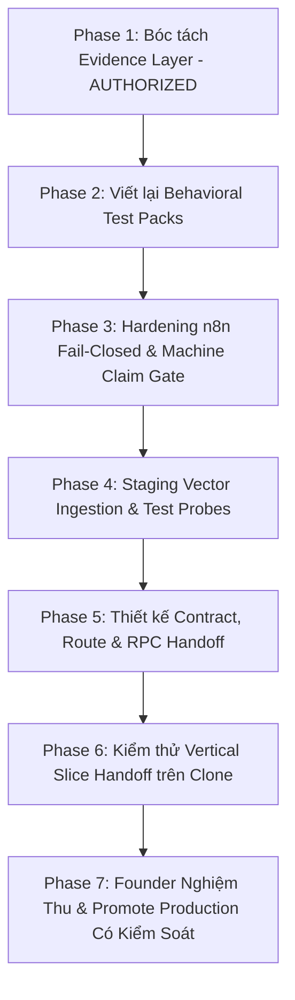

# MASTER IMPLEMENTATION PLAN: MARKETING KNOWLEDGE INGESTION & CROSS-DEPARTMENT HANDOFF

**Document ID:** `MKT-CSKH-MASTER-PLAN-v1.1`  
**Artifact Path:** `implementation_plan.md`  
**Target Environment:** Staging Supabase Clone (`ldhjrdihrcjsjfmrqtbi.supabase.co`) $\rightarrow$ Production Supabase (`jrgkpbjsqefvnhbiiutz.supabase.co`)  
**Status:** PHASE_1_AUTHORIZED_PENDING_PHASE_2_TO_6_GATE  

---

## 1. MỤC TIÊU & PHẠM VI HỆ THỐNG

1. **Chuẩn hóa nguyên liệu tri thức Marketing (KO-01 $\rightarrow$ KO-10):** Tách biệt triệt để lớp Quy chuẩn tư duy (*Framework*) khỏi lớp Dữ liệu chứng cứ thực tế (*Evidence Records*) để bảo vệ tính trừu tượng của hệ thống, chống ô nhiễm tri thức và chống "Hypothesis Laundering".
2. **Xây dựng luồng đồng bộ chiến dịch liên phòng ban (Marketing $\rightarrow$ CSKH):** Thiết lập cơ chế tự động bóc tách Battlecard/FAQ sau khi Founder duyệt chiến dịch Marketing để nạp trực tiếp vào kho tri thức Chatbot CSKH (`dept-cskh`).
3. **Thực thi kỷ luật kiểm định (Gatekeeper Compliance):** Toàn bộ thử nghiệm, embedding, và test probe phải hoàn tất trên môi trường Staging Clone với đầy đủ log chứng minh trước khi chạm vào Production DB.

---

## 2. CHUẨN HÓA KHẾ ƯỚC CƠ SỞ DỮ LIỆU (DATABASE CONTRACT ALIGNMENT)

Dựa trên migration thực tế `20260904000000_knowledge_architecture_v1_1.sql` và `20260824000008_crm_knowledge_schema.sql`:

1. **Cột trạng thái Document (`public.crm_knowledge_documents`):**
   - `knowledge_status`: `VARCHAR(20)` CHECK (`'DRAFT'`, `'REVIEWED'`, `'APPROVED'`, `'ACTIVE'`, `'SUPERSEDED'`, `'DEPRECATED'`, `'ARCHIVED'`).
   - `ingestion_status`: `VARCHAR(20)` CHECK (`'NOT_REQUIRED'`, `'PENDING'`, `'PROCESSING'`, `'SUCCESS'`, `'FAILED'`).
   - `is_active`: **KHÔNG TỒN TẠI DƯỚI DẠNG CỘT RIÊNG.** Vòng đời tài liệu được quản lý chuẩn xác qua điều kiện:  
     `WHERE knowledge_status = 'ACTIVE' AND ingestion_status = 'SUCCESS'`.
2. **Cấu trúc Chunks (`public.crm_knowledge_chunks`):**
   - Trạng thái `ACTIVE` và `SUCCESS` thuộc về bảng cha `crm_knowledge_documents`.
   - Bảng con `crm_knowledge_chunks` liên kết qua khóa ngoại `document_id`.
   - Metadata chuyên ngành (`department_id: "dept-cskh"`, `valid_from`, `valid_to`, `campaign_id`) được lưu trữ chuẩn hóa trong cột `JSONB`:
     - Document: `crm_knowledge_documents.knowledge_metadata`
     - Chunks: `crm_knowledge_chunks.metadata`
3. **Chiến lược Cleanup Append-Only:**
   - Tuyệt đối **không dùng lệnh DELETE** để tránh phá vỡ tính toàn vẹn audit (`crm_knowledge_audit_logs`).
   - Khi dọn dẹp hoặc chiến dịch hết hạn: Update `crm_knowledge_documents.knowledge_status = 'ARCHIVED'` hoặc `'DEPRECATED'`. Trigger audit log sẽ tự động ghi nhận lịch sử thay đổi mà không làm mất dữ liệu kiểm toán.

---

## 3. NGUYÊN TẮC BẢO VỆ VÙNG AN TOÀN (BLAST RADIUS & SAFETY GATES)

> [!IMPORTANT]
> - **Production DB Zero Mutation Invariant:** Tuyệt đối không thực hiện bất kỳ thao tác ghi/xóa/migration nào lên Production Supabase (`jrgkpbjsqefvnhbiiutz.supabase.co`) trong suốt Phase 1 đến Phase 6.
> - **Human Authority Boundary:** Chiến dịch do AI lập chỉ được chuyển trạng thái sang `APPROVED`/`ACTIVE` và handoff sang CSKH khi có chữ ký số/hành động bấm duyệt của Founder trên Web UI.
> - **Customer Handover Boundary:** Trạng thái bàn giao khách hàng ngoài giữ nguyên `BLOCKED`. Hệ thống chỉ phục vụ vận hành nội bộ của PN Media Plus.

---

## 4. CHI TIẾT 7 PHÂN KỲ TRIỂN KHAI (PHASES & RESPONSIBILITY MATRIX)



---

### PHASE 1: BÓC TÁCH EVIDENCE LAYER TỪ KHO TÀI LIỆU GỐC (AUTHORIZED)
- **Owner:** Knowledge Engineer / Dev Bot
- **Trạng thái:** **ĐƯỢC PHÉP THỰC THI (AUTHORIZED)**
- **Mục tiêu:** Tạo thư mục `TAI LIEU MARKETING/EVIDENCE_RECORDS/` độc lập để lưu trữ dữ liệu thực tế, giữ cho KO-01 $\rightarrow$ KO-10 thuần khiết là Framework.
- **Entry Criteria:** 12 tài liệu gốc trong `TAI LIEU TRI THUC` sẵn sàng ở trạng thái đọc.
- **Deliverables:**
  1. `EV_CUST_CUSTOMER_VOICE_v1.0.yaml`: Trích xuất 15-20 câu thoại thực tế (Verbatim), phản đối, thắc mắc từ `00_CSKH_MASTER_KNOWLEDGE_v1.0.md` (Metadata: `epistemic_status: VERIFIED_CSKH_RECORD`).
  2. `EV_COMM_COMMERCIAL_AUTHORITY_v1.0.yaml`: Trích xuất cấu trúc giá Setup 12-18tr và gói user từ `PN_AGENCY_CRM_PRICE_MATRIX_v1.0.md` (Metadata: `epistemic_status: FOUNDER_LOCKED_PRICING`).
  3. `EV_WORKFLOW_PAIN_RECORDS_v1.0.yaml`: Trích xuất 3 điểm gãy bàn giao Sales $\rightarrow$ Account và giới hạn sản phẩm từ `03_BUSINESS_WORKFLOW_GUIDE.md` và `05_KNOWN_LIMITATIONS.md`.
- **Exit Criteria:** Cả 3 file YAML được validate cú pháp hợp lệ, 100% dữ liệu có nguồn dẫn chứng, 0 số liệu bịa đặt.

---

### PHASE 2: CHUẨN HÓA BEHAVIORAL ACCEPTANCE TEST PACKS
- **Owner:** QA Bot / Dev Bot
- **Mục tiêu:** Thay thế 9 file template 20 dòng copy-paste bằng kịch bản kiểm thử hành vi thực tế cho KO-02 đến KO-10.
- **Entry Criteria:** Phase 1 hoàn tất, schemas định dạng có sẵn.
- **Deliverables:**
  - Cập nhật 9 file `KO-0X_AGENT_ACCEPTANCE_TEST_PACK_v1.0.md` với cấu trúc chuẩn:
    - `Input Scenario` (Tình huống đầu vào cụ thể của Agency VN).
    - `Required Decision` (Hành vi bắt buộc Agent phải quyết định).
    - `Forbidden Behavior` (Hành vi cấm kỵ: không bịa tính năng, không giảm giá, không cam kết doanh thu).
- **Exit Criteria:** Mỗi test pack có ít nhất 3 kịch bản kiểm thử hành vi cụ thể, được đối soát với KO-01 Hard Gates.

---

### PHASE 3: HARDENING N8N FAIL-CLOSED & MACHINE CLAIM GATE
- **Owner:** n8n Workflow Engineer
- **Mục tiêu:** Loại bỏ lỗ hổng fallback và bổ sung rào chắn kiểm duyệt nội dung (Claim Gate) trong n8n Workflow 075 Staging.
- **Entry Criteria:** File workflow `075_N8N_CAMPAIGN_PLANNER_STRICT.json` trên n8n Staging.
- **Deliverables:**
  1. **Triệt tiêu Fallback:** Xóa bỏ code tự gán `namespace: "marketing"` khi thiếu dữ liệu. Nếu thiếu `organization_id` hoặc `department_id` $\rightarrow$ Ném lỗi `FAIL_CLOSED_MISSING_METADATA` dừng ngay lập tức.
  2. **Machine Claim Gate Node:** Thêm logic kiểm tra từ khóa cấm (`tự động hóa 100%`, `hóa đơn đỏ`, `tính lương`, `cam kết doanh thu`). Nếu phát hiện vi phạm ranh giới KO-01/06 $\rightarrow$ Đánh dấu `REJECTED_CLAIM_VIOLATION`.
- **Exit Criteria:** Bắn 2 request test vào n8n Staging (1 request thiếu header $\rightarrow$ 403/Fail-closed, 1 request chứa từ khóa cấm $\rightarrow$ QA Node reject).

---

### PHASE 4: STAGING CLONE VECTOR INGESTION & TEST PROBES
- **Owner:** Database Bot
- **Mục tiêu:** Nạp toàn bộ 10 KO + 3 Evidence Records vào Supabase Clone và kiểm chứng độ chính xác khi Agent 1 truy vấn.
- **Entry Criteria:** Supabase Clone (`ldhjrdihrcjsjfmrqtbi.supabase.co`) kết nối thông suốt với Service Role Key.
- **Deliverables:**
  1. Script `scripts/ingest-marketing-knowledge-staging.ts`: Parse markdown, chunking ngữ nghĩa, tạo embedding qua `text-embedding-3-small`.
  2. Nạp vào Supabase Clone tuân thủ đúng schema:  
     - Bảng `crm_knowledge_documents`:  
       `knowledge_status = 'ACTIVE'`, `ingestion_status = 'SUCCESS'`,  
       `knowledge_metadata = { "organization_id": "8289488a-b255-4cb6-9bff-c9d2e71af160", "department_id": "dept-marketing", "version": "v1.0" }`.
     - Bảng `crm_knowledge_chunks`: Gán embedding và liên kết `document_id`.
  3. Bắn 3 Probe Tests từ n8n Staging:
     - *Probe 1 (Happy Path):* Yêu cầu chiến dịch cho Agency 15 người $\rightarrow$ Agent 1 trích xuất đúng nỗi đau từ KO-04/05/07.
     - *Probe 2 (Feature Trap):* Yêu cầu thêm module hóa đơn đỏ $\rightarrow$ Agent 1 từ chối theo KO-06.
     - *Probe 3 (Price Trap):* Yêu cầu giảm 50% phí setup $\rightarrow$ Agent 1 từ chối theo KO-01/Price Matrix.
- **Exit Criteria:** 100% tài liệu đạt `knowledge_status = 'ACTIVE'` và `ingestion_status = 'SUCCESS'`. Cả 3 Probes PASS với log chứng minh.

---

### PHASE 5: THIẾT KẾ CONTRACT, ROUTE & RPC HANDOFF (MARKETING $\rightarrow$ CSKH)
- **Owner:** System Architect & Backend Bot
- **Mục tiêu:** Xây dựng khế ước dữ liệu, API Route và RPC function cần thiết trước khi viết E2E test.
- **Entry Criteria:** Kế hoạch 25 sections của Marketing đã được kiểm chứng ở Phase 4.
- **Deliverables:**
  1. **Contract Type:** File `src/types/campaign-handoff.ts` & JSON Schema.
  2. **API Route:** Tạo endpoint `src/app/api/campaigns/handoff-to-cskh/route.ts` với xác thực Service Role Key hoặc Founder Session.
  3. **Database RPC / Storage Map:** Bóc tách `cskh_battlecard` và `campaign_faq` lưu thành một document mới trong `crm_knowledge_documents` với metadata:  
     `knowledge_metadata = { "department_id": "dept-cskh", "type": "active_campaign", "valid_from": "...", "valid_to": "..." }`.
- **Exit Criteria:** Route trả về 200 OK khi nhận payload mẫu, có xác thực bảo mật.

---

### PHASE 6: KIỂM THỬ "VERTICAL SLICE HANDOFF" TRÊN STAGING CLONE
- **Owner:** Fullstack Bot / QA Lead
- **Mục tiêu:** Kiểm chứng thực tế toàn bộ luồng Handoff từ lúc Founder duyệt đến khi Chatbot CSKH trả lời được theo chiến dịch mới.
- **Entry Criteria:** Phase 4 và Phase 5 đã hoàn tất trên Clone.
- **Kịch bản thực thi 6 bước thực tế (Vertical Slice Test):**
  1. Giả lập tạo 1 Campaign Synthetic trên Staging: `CAMP-SYNTHETIC-20260905`.
  2. Giả lập sự kiện Founder bấm Duyệt $\rightarrow$ Gọi route `/api/campaigns/handoff-to-cskh`.
  3. Route tự động tạo document và chunks trong Supabase Clone với `knowledge_status = 'ACTIVE'`, `ingestion_status = 'SUCCESS'`, `department_id = 'dept-cskh'`.
  4. **Bắn Retrieval Probe:** Giả lập khách hỏi Fanpage về ưu đãi chiến dịch $\rightarrow$ CSKH Chatbot trả lời chính xác thông tin từ Battlecard vừa nạp.
  5. **Kiểm thử Thu hồi (Append-Only Deprecation Test):** Gọi RPC cập nhật `knowledge_status = 'ARCHIVED'`. Trigger ghi log audit.
  6. **Re-probe:** Bắn lại câu hỏi $\rightarrow$ CSKH Chatbot tự động ngừng tư vấn ưu đãi đó và quay về bảng giá chuẩn (do câu query lọc `knowledge_status = 'ACTIVE'`).
- **Exit Criteria:** Xuất trình đầy đủ execution logs, database record IDs, và timestamp chứng minh 6 bước hoạt động hoàn hảo.

---

### PHASE 7: FOUNDER NGHIỆM THU & PROMOTE LÊN PRODUCTION DB
- **Owner:** Founder / Release Lead
- **Entry Criteria:** Phase 6 đạt 100% tiêu chí kiểm định, Gatekeeper ký duyệt `vertical_slice: PASS`.
- **Quy trình Promote có kiểm soát (Verifiable Artifact/Migration):**
  1. **Founder Review:** Anh Founder truy cập trực tiếp Web Chat UI (`agent.pnmediaplus.com`), gửi brief và kiểm tra chất lượng kế hoạch thực tế.
  2. **Preflight Check:** Đối soát hash checksum của các file tri thức, kiểm tra cấu trúc schema trên Production DB (`jrgkpbjsqefvnhbiiutz.supabase.co`).
  3. **Controlled Ingestion:** Chạy script ingest trực tiếp trên Production từ nguồn artifact đã khóa, tuyệt đối không copy vector mù từ Clone sang Production.
  4. **Verification:** Chạy liveness check `/api/health` và 1 probe test an toàn trên Production.
- **Exit Criteria:** Production DB ghi nhận đầy đủ tài liệu ở trạng thái `knowledge_status = 'ACTIVE'` và `ingestion_status = 'SUCCESS'`, không có side effect, chính thức cấp mốc bàn giao vận hành nội bộ.

---

## 5. KẾ HOẠCH CLEANUP & ROLLBACK (PHỤC HỒI SỰ CỐ)

1. **Rollback Môi trường Production:**
   - Điểm mốc an toàn đã gắn tag chuẩn xác: **`prod-known-good-20260905`** (đối soát tại baseline commit **`313e4f9`**).
   - Lệnh khôi phục khẩn cấp trên VPS nếu có sự cố:
     ```bash
     cd /var/www/agent.pnmediaplus.com
     git switch --detach prod-known-good-20260905
     docker compose up -d --build --force-recreate
     ```
2. **Cleanup Môi trường Staging Clone (Append-Only Strategy):**
   - Mọi bản ghi thử nghiệm từ Synthetic Campaign trong Phase 6 sẽ được cập nhật sang `knowledge_status = 'ARCHIVED'`, đảm bảo tuân thủ nguyên tắc append-only của `crm_knowledge_audit_logs`.
   - Không thực hiện xóa cứng (hard delete) dữ liệu audit.

---

## 6. TỔNG KẾT TIÊU CHÍ NGHIỆM THU (EXIT CRITERIA GATE)

```yaml
phase_1_evidence_extraction: AUTHORIZED_TO_EXECUTE
phase_2_behavioral_tests: REQUIRED_PASS
phase_3_n8n_claim_hardening: REQUIRED_PASS
phase_4_staging_ingestion: REQUIRED_PASS
phase_5_handoff_contract_and_route: REQUIRED_PASS
phase_6_vertical_slice_clone: REQUIRED_PASS_WITH_LOGS
phase_7_founder_approval: REQUIRED_PASS
production_mutation_before_phase_7: STRICTLY_FORBIDDEN
```
